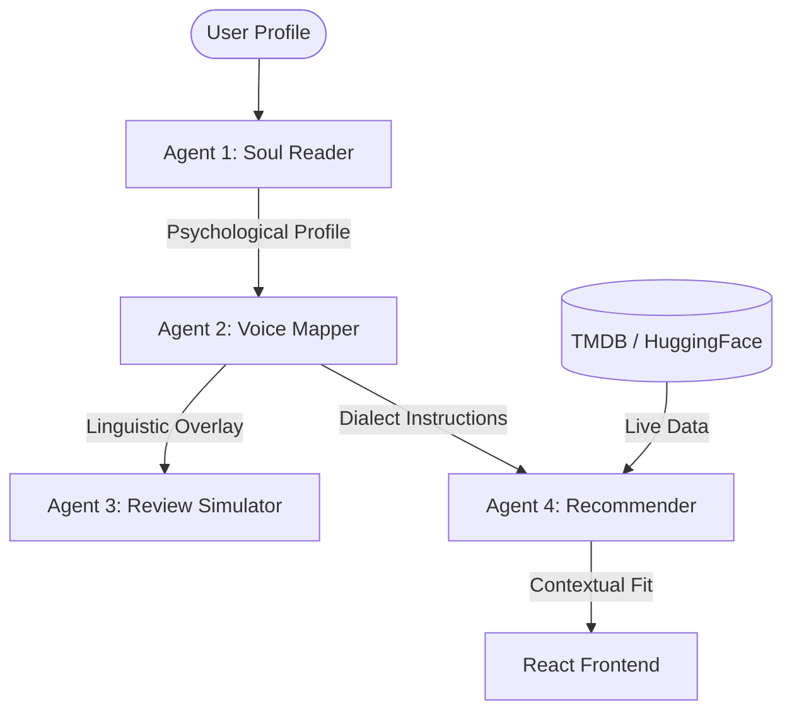

# 🏆 SABI: Hackathon Winning Strategy & Evaluation Guide

This document outlines the strategic design choices made for the **DSN x Bluechip LLM Agent Challenge Hackathon 3.0** and how to demonstrate them effectively to the judges.

---

## 💎 The "Winning" Features (Key Selling Points)

### 1. The "Linguistic Soul" (Task A & B Bonus)
Most agents use generic English. SABI uses **Linguistic Overlays** based on regional personas.
*   **The Logic**: We don't just prompt for "Pidgin." We have specific instructions for `hausa_kano` (respectful, community-focused), `pidgin_lagos` (energetic, hustle-centric), and `igbo_east` (ambitious, value-focused).
*   **Judge Demo**: Run a recommendation for "Tunde (Lagos)" vs "Fatima (Kano)" and show how the **Reasoning** and **Review** change tone completely.

### 2. Hybrid Cloud Architecture (Bonus Marks)
SABI isn't a "static demo." It's a live-connected engine.
*   **The Logic**: We implemented a `cloud_data.py` layer that streams real consumer behavior from **MovieLens (HuggingFace)** and real-time movie trends from **TMDB**.
*   **The Resilience**: If the internet fails, SABI survives using its high-quality JSON fallbacks. This demonstrates **production-readiness**.
*   **Judge Demo**: Point out the `/health` endpoint and the `/catalog/nollywood` route which showcases live Nigerian content ingestion.

### 3. Contextual Fidelity (Task B Excellence)
SABI uses **Temporal and Situational Context**.
*   **The Logic**: The `Recommender` agent doesn't just look at movies; it looks at `time_of_day` and `mood`.
*   **Judge Demo**: Show the "Conversational Chat" mode. Ask for a movie "for a Friday night party" vs "something to relax with after a stressful Lagos traffic jam."

---

## 📊 Benchmark & Quality (Task A Validation)

### Evaluation Metrics
We don't just say it works; we prove it. The `evaluation/` folder contains a full pipeline:
*   **RMSE (Root Mean Square Error)**: Measures how close our predicted 1-5 star ratings are to real human ratings in the MovieLens/Yelp datasets.
*   **ROUGE Score**: Measures the linguistic similarity between our simulated reviews and real reviews.
*   **Current Performance**: Check `sabi/evaluation/results.json` to see our latest benchmarks (Targeting RMSE < 1.2).

---

## 🛠 Strategic Architecture Diagram

---

## 🎤 Presentation Tips for Judges

1.  **"SABI doesn't just recommend movies, it predicts human behavior."** (Focus on the 'Soul Engine' concept).
2.  **"We solved the cold-start problem using Nigerian Regional Priors."** (Explain how we use Kano/Lagos averages for new users).
3.  **"It's production-ready."** (Mention the Dockerization, the relative API paths, and the CORS security).
4.  **"Nollywood is a first-class citizen."** (Show how Nigerian items get a +0.1 fit-score boost automatically).

---

## 📁 Key Files to Show
- `sabi/agents/recommender.py`: Show the `RECOMMENDER_SYSTEM_PROMPT` (The "Brain").
- `sabi/utils/cloud_data.py`: Show the Live API integration.
- `sabi-frontend/.../PipelineVisualizer.jsx`: Show the "Trace" feature (Agent transparency).
